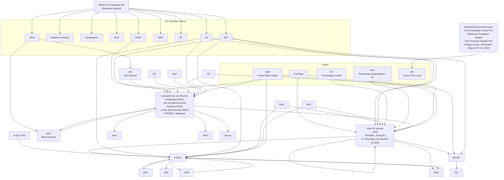

# FBA

## R functions mapped

- [x] ROScalc
- [x] C6calc
- [x] BEcalc
- [ ] Slopecalc

## CFFDRS

```mermaid
graph

    WF1API["WFWX Fire Weather API</br>[Software System]"]
    subgraph Indices["Fire Weather Indices"]
        Wind
        RH["Relative Humidity"]
        Temperature
        Rain
        FFMC
        DMC
        DC
        ISI
        BUI
    end

    subgraph Inputs
        FuelType
        PC["PC</br>Percentage Conifer"]
        PDF["PDF</br>Percentage Dead Balsam Fir"]
        CBH["CBH</br>Crown Base Height"]
        CFL["CFL</br>Crown Fuel Load"]
    end

    STX3["Development and Structure of the Canadian Forest Fire Behaviour Prediction System</br> from Forestry Canada Fire Danger Group, Information Report ST-X-3, 1992"]

    STX3-->CFL

    ROScalc["Rate Of Spread</br>ROS</br>CFFDRS::.ROScalc</br>C1 only takes ISI and BUI as input"]
    Slopecalc["Calculate the net effective windspeed (WSV),</br> the net effective wind direction (RAZ)</br> or the wind azimuth (WAZ).</br>CFFDRS::.Slopecalc"]

    Wind-->WS
    Wind-->WAZ

    WS["WS</br>Wind Speed"]
    WAZ["WAZ</br>Wind Azimuth"]

    WF1API-->Wind
    WF1API-->RH
    WF1API-->Temperature
    WF1API-->Rain
    WF1API-->FFMC
    WF1API-->DMC
    WF1API-->DC
    WF1API-->ISI
    WF1API-->BUI


    FuelType-->ROScalc
    ISI-->ROScalc
    BUI-->ROScalc
    FMC-->ROScalc
    SFC-->ROScalc
    PC-->ROScalc
    PDF-->ROScalc
    CC-->ROScalc
    CBH-->ROScalc
    ROScalc-->ROScalc
    ROScalc-->C6calc
    ROScalc-->BEcalc
    ROScalc-->ROS

    FuelType-->BEcalc
    BUI-->BEcalc
    BEcalc-->BE

    FUELTYPE-->C6calc
    ISI-->C6calc
    BUI-->C6calc
    FMC-->C6calc
    SFC-->C6calc
    CBH-->C6calc
    ROS-->C6calc
    CFB-->C6calc
    RSC-->C6calc
    C6calc-->ROS
    C6calc-->CFB
    C6calc-->RSC
    C6calc-->RSI

    FuelType-->Slopecalc
    FFMC-->Slopecalc
    BUI-->Slopecalc
    WS-->Slopecalc
    WAZ-->Slopecalc
    GS-->Slopecalc
    SAZ-->Slopecalc
    CC-->Slopecalc
    CBH-->Slopecalc
    ISI-->Slopecalc
    Slopecalc-->RAZ
    Slopecalc-->WSV
    Slopecalc-->WAZ
    Slopecalc-->ISIcalc
    Slopecalc-->ROScalc


```
