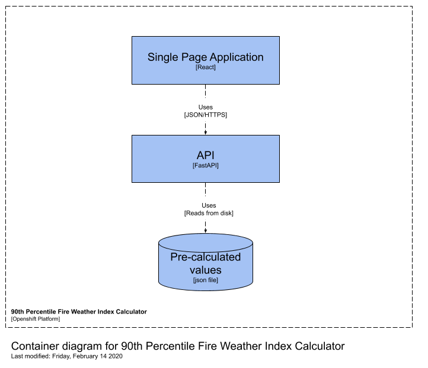

# Wildfire Predictive Services FWI Percentile Calculator API

## Description

Wildfire Predictive Services support decision making in prevention, preparedness, response and recovery.

## Getting Started

### Dependencies

- Docker [Mac](https://hub.docker.com/editions/community/docker-ce-desktop-mac/), [Win](https://hub.docker.com/editions/community/docker-ce-desktop-windows/), [Ubuntu](https://docs.docker.com/install/linux/docker-ce/ubuntu/), [Fedora](https://docs.docker.com/install/linux/docker-ce/fedora/)

- Docker Compose

```
brew install docker-compose
```

### Installing

You will need a .env file, .env.example ; For local development, you can copy .env.example to .env.

#### Local machine, in docker

```
docker-compose build
```

#### Local machine, running MacOS

Install system dependancies:

```
brew install pyenv
pyenv install 3.8.1
brew install pipenv
brew install postgresql
```

Install project requirements:

```
cd wps-api
pipenv install --dev
```

If you have trouble getting pipenv to resolve python 3.8.1, you can also try explicitly specifying the python location:

```
pipenv install --python ~/.pyenv/versions/3.8.1/bin/python3.8 --dev
```

##### Troubleshooting

If you experience errors when installing `psycopg2` in your virtual environment (pipenv) and you are using MacOS, try running
`env LDFLAGS="-I/usr/local/opt/openssl@1.1/include -L/usr/local/opt/openssl@1.1/lib" pipenv install psycopg2`
from the command line.

#### Local machine, running Linux

If you have trouble installing pyodbc, you can try:

##### Ubuntu

```
sudo apt install unixodbc-dev
```

##### Fedora

```
sudo dnf install unixODBC-devel
```

### Executing program

See [Makefile](Makefile) for examples of running the API in docker.

e.g.:

```
make init
```

will execute `pipenv install --dev`, which is required before executing the program locally for the first time.

```
make docker-run
```

will execute:

```
docker-compose run api scripts/test.sh
docker-compose up
```

#### Local machine, running mac os

See [Makefile](Makefile) for examples or running the API on your local machine.

e.g.:

```
make run
```

will execute:

```
pipenv run pylint --rcfile=.pylintrc *.py **/*.py
pipenv run python -m pytest
pipenv run uvicorn main:APP --reload --port 8080
```

To shell into the Docker container for the database, execute `make docker-shell-db`.

### Running the database locally

Executing `make docker-build-dev` followed by `make docker-run-dev` will build and run the Docker container needed to run the application locally. Running the dev container will also spin up a local Postgres service and will create a local copy of the wps database with the necessary schemas.

To access the local copy of the database, you can shell into it by opening a new terminal window and executing `psql -h localhost -p 5432 -U <db-username>` and enter the local database password when prompted.

## Contributing

### Coding conventions

Code must be [PEP8](https://www.python.org/dev/peps/pep-0008/) compliant with the exception of allowing for line lengths up to 110 characters.
Compliance is enforced using [Pylint](https://www.pylint.org/) and a [.pylintrc](.pylintrc) file.

Run pylint to check that your code conforms before pushing code to the repository:

```
make lint
```

Or enforce by running [scripts/lint.sh](scripts/lint.sh) as part of your ci/cd pipeline.

### Testing

Code must pass all unit tests.

Run python unit tests before pushing code to the repository:

```
make test
```

Or enforce by running [scripts/test.sh](scripts/test.sh) as part of your ci/cd pipeline.

### Branch naming conventions

Branches must be named in accordance with the rules specified in [.githooks/pre-push](.githooks/pre-push).

- branch names should be informative, meaningful and concise.
- branch names should follow the pattern (category)/(description)/(ticket number)

```
# Enforce branch naming conventions for this project using git hooks.
git config core.hooksPath .githooks
```

example of a good branch name:

```
# Task related to re-factoring of logging, the ticket number being 123:
task/re-factor-logging/123
```

example of a bad branch name:

```
wps-123
```

## Architecture



## Config Maps & Secrets

In `openshift/templates/global.config.yaml` there are templates for a global ConfigMap and global Secrets used by the API.
These templates can be applied to the Openshift project from the command line. For example, to apply the global.config template and pass a value for the WFWX-AUTH-URL parameter, run

`oc -n <openshift-project-name> process -f openshift/templates/global.config.yaml -p WFWX-AUTH-URL=https://spotwx.com/ | oc create -f -`

## License

This project is licensed under the [Apache License, Version 2.0](https://github.com/bcgov/wps-api/blob/master/LICENSE).

## Acknowledgments

[](https://sonarcloud.io/dashboard?id=bcgov_wps-api)

Template copied from

- [DomPizzie](https://gist.github.com/DomPizzie/7a5ff55ffa9081f2de27c315f5018afc)
