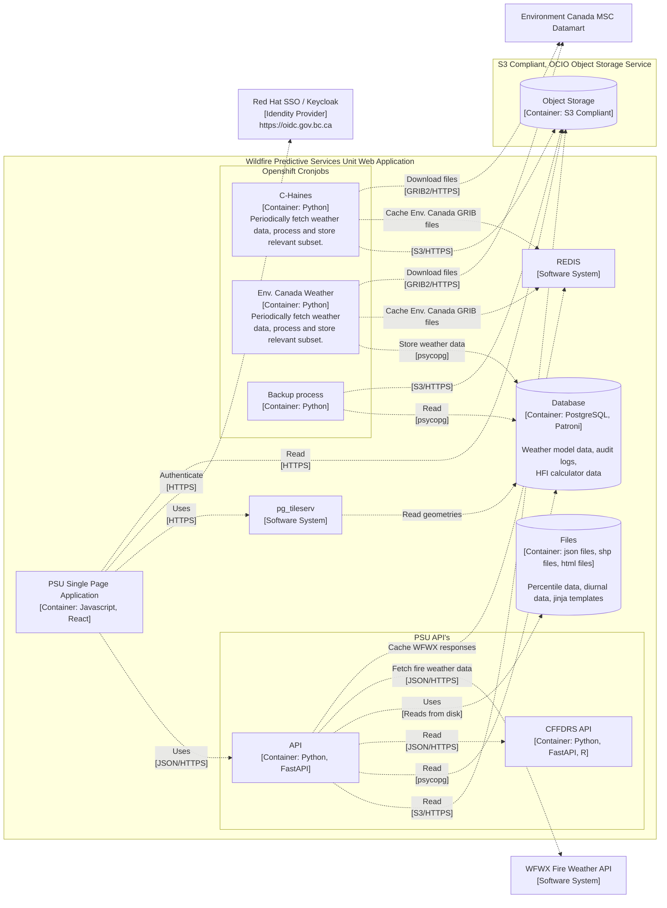
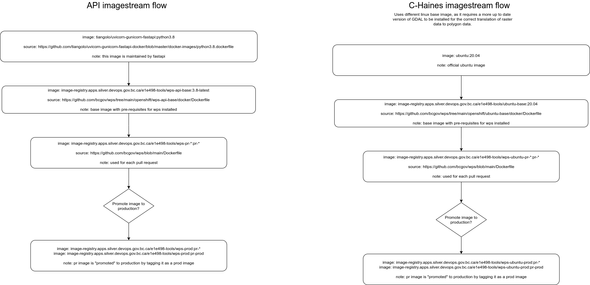

[](/../../issues)
[](/LICENSE)
[](https://github.com/bcgov/repomountie/blob/master/doc/lifecycle-badges.md)
[](https://codecov.io/gh/bcgov/wps)

# Wildfire Predictive Services

## Description

Wildfire Predictive Services to support decision making in prevention, preparedness, response and recovery.

## Getting Started

### Dependencies

### Installing

#### Running the application locally in docker:

1. Create `.env` file in `web` using `web/.env.example` as a sample.
2. Create `.env.docker` file in `api/app` using `api/app/.env.example` as a sample.
3. Run `docker-compose build` and then `docker-compose up`
4. Open [http://localhost:8080](http://localhost:8080) to view the front end served up from a static folder by the python api.
5. Open [http://localhost:3000](http://localhost:3000) to view the front end served up in developer mode by node.

#### Running the api alone

Refer to [api/README.md](api/README.md).

#### Running the front end alone

Refer to [web/README.md](api/README.md)

## License

[Apache 2.0](https://www.apache.org/licenses/LICENSE-2.0) License - see the [LICENSE.md](https://github.com/bcgov/wps/blob/main/LICENSE)

## Glossary

A glossary of terms relating to Wildfire that are relevant to Predictive Services can be found at the [Predictive Wildfire Wiki Glossary Page](https://github.com/bcgov/wps/wiki/Glossary)

## Architecture



### Imagestream flow



## Contributing

### PRs

Your Github PR is required to pass all our CI checks, including our test coverage threshold via CodeCov: https://docs.codecov.com/docs/about-code-coverage

### Branch naming conventions

Branches must be named in accordance with the rules specified in [.githooks/pre-push](.githooks/pre-push).

- branch names should be informative, meaningful and concise.
- branch names should follow the pattern (category)/(description)/(ticket number)

```
# Enforce branch naming conventions for this project using git hooks.
git config core.hooksPath .githooks
```

example of a good branch name:

```
# Task related to re-factoring of logging, the ticket number being 123:
task/re-factor-logging/123
```

example of a bad branch name:

```
wps-123
```

### How to contribute

Resources:

- [Issues](https://github.com/bcgov/wps/issues)
- [ZenHub Board](https://app.zenhub.com/workspaces/wildfire-predictive-services-5e321393e038fba5bbe203b8/board?repos=235861506,237125626,237125691)
- [PEP8](https://github.com/python/peps/blob/master/pep-0008.txt) and [PEP20](https://github.com/python/peps/blob/master/pep-0020.txt) coding conventions, but with 110 character line breaks
- [Code of Conduct](https://github.com/bcgov/wps/blob/master/CONDUCT.md)

## Acknowledgments

[](https://sonarcloud.io/dashboard?id=bcgov_wps)
