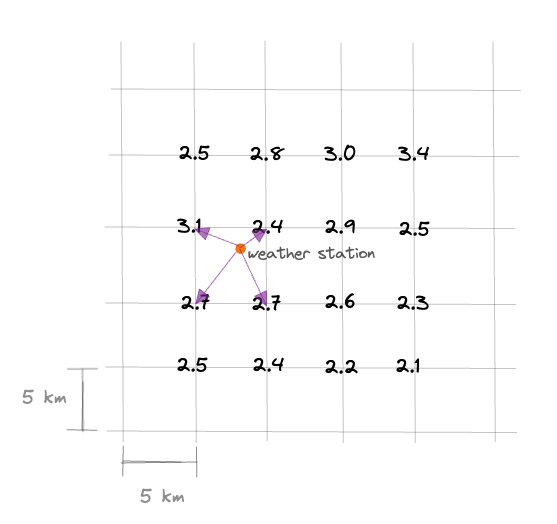

<!-- omit in toc -->
# Fetching & Interpreting Weather Model Data

<!-- omit in toc -->
## Table of Contents

- [Introduction](#introduction)
- [GRIB Files](#grib-files)
- [Data Sources](#data-sources)
  - [Environment Canada](#environment-canada)
    - [Relevant Data Links](#relevant-data-links)
      - [GDPS](#gdps)
      - [RDPS](#rdps)
      - [HRDPS](#hrdps)
    - [Relevant Weather Variables](#relevant-weather-variables)
  - [NOAA](#noaa)
    - [GFS](#gfs)
      - [Model Run Cycles](#model-run-cycles)
    - [NAM](#nam)
      - [Model Run Cycles](#model-run-cycles-1)
    - [Relevant Weather Variables](#relevant-weather-variables-1)
- [Downloading Data](#downloading-data)
- [Linear Interpolation](#linear-interpolation)
  - [From grids to fire weather stations](#from-grids-to-fire-weather-stations)
  - [To 12:00 PST (13:00 PDT)](#to-1200-pst-1300-pdt)
  - [Calculating predicted 24 hour precipitation](#calculating-predicted-24-hour-precipitation)
- [Cronjobs](#cronjobs)

## Introduction

Some of the core functionalities of Morecast (versions 1 and 2) require that we regularly fetch weather model data from various sources. These weather models are computer-generated weather forecasts (although for the sake of clarity, throughout this project we refer to them as "weather models", whereas "forecasts" strictly apply to the weather predictions made by human weather forecasters). Third-party organizations run these weather models on their own hardware and publish the output publicly. Morecast then regularly consumes this weather model data and performs additional analysis on it to suit our specific needs.

## GRIB Files

All weather model produce outputs in GRIB file format. [Refer here for a description of what a GRIB file is](https://weather.gc.ca/grib/what_is_GRIB_e.html).

A GRIB file contains one or more raster bands, in which weather data is presented in a grid format. Each raster band corresponds to one weather variable. (For example, temperature data points will be stored in a different raster band to wind speed data points.) When we fetch a specific raster band from a data grid (using gdal's `GetRasterBand(<band_id>)`), we get a 2-dimensional array of numeric values (usually floats) containing the values for the relevant weather variable. In order to coalesce the points on the data grid with geographic locations (such as lat/long coordinates), a geographic coordinate transformation must be applied. This coordinate transformation is performed in our backend, using metadata supplied by the source of the GRIB file.

## Data Sources

### Environment Canada

We fetch GDPS, RDPS, and HRDPS model data from Environment Canada (EC). EC outputs a separate GRIB file for each weather variable, and each GRIB file contains only one raster band. (There are many weather variables available, we only download the files that Morecast needs.)

The GDPS, RDPS, and HRDPS models have different cycle lengths, different resolutions, and different coordinate systems. For example, the [RDPS model](https://weather.gc.ca/grib/grib2_reg_10km_e.html) uses a resolution of 10km projected onto a polar stereographic grid, while the [GDPS model](https://weather.gc.ca/grib/grib2_glb_25km_e.html) uses a 25km resolution on a lat-lon grid. For the [HRDPS model](https://weather.gc.ca/grib/grib2_HRDPS_HR_e.html), we use the Continental domain, which has a resolution of 2.5km on a polar stereographic grid.

#### Relevant Data Links

##### GDPS
- [GDPS weather variables for 0-hour forecasts](https://weather.gc.ca/grib/GLB_HR/GLB_latlonp24xp24_P000_deterministic_e.html)
- [GDPS weather variables for non-zero-hour forecasts](https://weather.gc.ca/grib/GLB_HR/GLB_latlonp24xp24_P003144_03_and_P150168_06_deterministic_e.html)
- [Formatting of filenames (and data download source)](https://weather.gc.ca/grib/grib2_glb_25km_e.html)

##### RDPS
- [RDPS weather variables for 0-hour forecasts](https://weather.gc.ca/grib/REG_HR/REGIONAL_ps10km_P000_deterministic_e.html)
- [RDPS weather variables for non-zero-hour forecasts](https://weather.gc.ca/grib/REG_HR/REGIONAL_ps10km_PNONZERO_deterministic_e.html)
- [Formatting of filenames](https://weather.gc.ca/grib/grib2_reg_10km_e.html)
- [Data download source](https://dd.weather.gc.ca/model_gem_regional/10km/grib2/)

##### HRDPS
- [HRDPS weather variables for 0-hour forecasts](https://weather.gc.ca/grib/HRDPS_HR/HRDPS_nat_ps2p5km_P000_deterministic_e.html)
- [HRDPS weather variables for non-zero-hour forecasts](https://weather.gc.ca/grib/HRDPS_HR/HRDPS_ps2p5km_PNONZERO_deterministic_e.html)
- [Formatting of filenames](https://weather.gc.ca/grib/grib2_HRDPS_HR_e.html)
- [Data download source](https://dd.weather.gc.ca/model_hrdps/continental/grib2/)

#### Relevant Weather Variables

The GDPS, RDPS, and HRDPS weather variables that we currently fetch for use in Morecast are `TMP_TGL_2m` (temperature), `RELH_TGL_2m` (relative humidity), `WIND_TGL_10m` (wind speed), `WDIR_TGL_10m` (wind direction), and `APCP_SFC_0` (accumulated precipitation since the start of the model run).

### NOAA

We fetch GFS and NAM model data from [NOMADS-NOAA](https://nomads.ncep.noaa.gov/). NOAA outputs only one GRIB file for all weather variables for a specific timestamp, so each of their GRIB files contains hundreds of raster bands, with one raster band for each weather variable. However, NOAA has created a Perl script that allows for filtering a GRIB file to only retrieve certain raster bands. We use this filtering as we only need a very small subset of the ~600 band layers available. We also use a geographic "subregion" filter to only retrieve GRIB data for BC. The values used are:

Top latitude: 60
Left longitude: -139
Right longitude: -114
Bottom latitude: 48

#### GFS

We fetch GFS model data on a 0.25&deg; scale (roughly equivalent to 24km at the centre of BC). 

##### Model Run Cycles

NOAA runs the GFS model 4 times a day at 00:00, 06:00, 12:00, and 18:00 UTC. For each of these model runs, the model predicts weather at 3-hour intervals for 384 hours (16 days) in advance. This means that for any given day, the GFS model makes weather predictions that correspond to 00:00, 03:00, 06:00, 09:00, 12:00, 15:00, 18:00, and 21:00 UTC.

Since Morecast users have indicated that they make forecasts up to a maximum of 10 days in advance, we only fetch GFS model data up to 240 hours (10 days) in advance.

Additionally, GFS model data is only relevant to Morecast users for the 12:00 PST (13:00 PDT) timeframe - this is the time of day that a fire weather forecast is issued for. Noon PST corresponds to 20:00 UTC, but the GFS model has no output for this hour. We therefore fetch predicted weather values at the time intervals of each model run cycle that correspond to 18:00 and 21:00 UTC, and subsequently perform linear interpolation to calculate approximate weather values for 20:00 UTC. Note that we are fetching these predicted weather values for each of the 4 GFS model run cycles that happen each day, since the values may change slightly with each model run.

Therefore, to predict weather for 12:00 PST, we must fetch the following model run cycles:

- run time 0000: hours 018 and 021
- run time 0600: hours 012 and 015
- run time 1200: hours 006 and 009
- run time 1800: hours 000 and 003

#### NAM

NAM model data is published on a Polar Stereographic projection at a 32km resolution. We use the "North America" grid (referred to as "awip32" on the NOAA server), since it's the only one available that covers the entirety of BC.

##### Model Run Cycles

The NAM model makes predictions for every hour for the first 36 hours, and then on a 3-hourly schedule to 84 hours [https://mag.ncep.noaa.gov/model-guidance-model-parameter.php?group=Model%20Guidance&model=NAM&area=NAMER&ps=area#]. As with the GFS model, we sometimes need to fetch data for 2 different hour offsets and then perform linear interpolation in order to have a weather prediction for 12:00 PST. The file naming convention that NAM uses indicates the model runtime as hours in UTC, and indexes that hour as 00. All subsequent hours in the model run are referenced as offsets of the 00 hour index. This means that for the 00:00 UTC model cycle, 20:00 UTC (or 12:00 PST) is referenced as hour 20; but for the 12:00 UTC model cycle, 20:00 UTC is referenced as hour 8 (20:00 - 12:00). Therefore, to fetch the noon PST data we need, the NAM cronjob pulls the following model hours:

- For the 00:00 UTC model run time:
  - Accumulation hours: 12, 24, 36, 48, 60
  - Day 0: hour 20 (20:00 UTC = 12:00 PST)
  - Day 1: hours 42 and 45, to interpolate for hour 44 (20:00 UTC)
  - Day 2: hours 66 and 69, to interpolate for hour 68 (20:00 UTC)
- For the 06:00 UTC model run time:
  - Accumulation hours: 6, 12, 18, 24, 30, 36, 42, 48, 60
  - Day 0: hour 14 (6+14 = 20:00 UTC)
  - Day 1: hours 36 and 39, to interpolate for hour 38 (38-24=14 hours, 14+06:00 = 20:00 UTC of the next day)
  - Day 2: hours 60 and 63, to interpolate for hour 62 (20:00 UTC of 2 days later)
- For the 12:00 UTC model run time:
  - Accumulation hours: 12, 24, 36, 48, 60, 72
  - Day 0: hour 8 (12+8 = 20:00 UTC)
  - Day 1: hour 32 (12+32-24 = 20:00 UTC of the next day)
  - Day 2: hours 54 and 57, to interpolate for hour 56 (56-48 hours = 8 hours, 8+12:00 = 20:00 UTC of 2 days later)
- For the 18:00 UTC model run time:
  - Accumulation hours: 6, 12, 18, 24, 30, 36, 42, 48, 60, 66, 72
  - Day 0: hour 2 (18+2 = 20:00 UTC)
  - Day 1: hour 26 (18+26-24 = 20:00 UTC of the next day)
  - Day 2: hours 48 and 51, to interpolate for hour 50 (50-48 hours = 2 hours, 2 + 18:00 = 20:00 UTC of 2 days later)

Note that the accumulation hours are required in order for us to calculate the cumulative precipitation across the model run which is needed when we subsequently calculate cumulative 24 hour precipitation.

#### Relevant Weather Variables

To be consistent with the weather variables that we pull from the Environment Canada models, for GFS we use comparable weather variables. There is a slight exception for wind direction and speed: Env Canada models output the separate U and V components for wind, but they also output the calculated wind speed and direction using those U, V components. NOAA only outputs the U,V components for wind - we must do the wind direction and wind speed calculations ourselves. The NOAA grib files for GFS contain two layers related to cumulative precipitation. Both layers are named 'apcp_sfc_0' but accumulate precipitation differently. Raster band 6 accumulates precip in 3 hour increments for odd hours and six hour increments for even hours, but we actually ignore this band. We use band 7 which accumulats precipitation across the model run.

The NAM grib file does not contain a band for cumulative precipitation since the start of the model. This requires us to use band 6 which accumulates precipitation slightly differently for model run hours 00 and 12 versus 06 and 18. The 00 and 12 hour model runs contain cumulative precipitation in 12 hour cycles. 

For the 00 and 12 hour model runs:

| Hour from start | Cumulative precip hours |
| --------------- | ----------------------- |
| 1 | 0 - 1 |
| 2 | 0 - 2 |
| 3 | 0 - 3 |
| ... | ... - ... |
| 12 | 0 - 12 |
| 13 | 12 - 13 |
| 14 | 12 - 14 |
| ... | ... - ... |
| 24 | 12 - 24 |
| 25 | 24 - 25 |
| ... | ... - ... |
| 36 | 24 - 36 |
| 39 | 36 - 39 |
| 42 | 36 - 42 |
| 45 | 36 - 45 |
| 48 | 36 - 48 |
| 51 | 48 - 51 |
| ... | ... - ... |

For the 06 and 18 hour model runs:

| Hour from start | Cumulative precip hours |
| --------------- | ----------------------- |
| 1 | 0 - 1 |
| 2 | 0 - 2 |
| 3 | 0 - 3 |
| 4 | 3 - 4 |
| 5 | 3 - 5 |
| 6 | 0 - 6 |
| 7 | 6 - 7 |
| 8 | 6 - 8 |
| 9 | 6 - 9 |
| 10 | 9 - 10 |
| 11 | 9 - 11 |
| 12 | 6 - 12 |
| 13 | 12 - 13 |
| ... | ... - ... |
| 36 | 30 - 36 |
| 39 |  36 - 39 |
| 42 | 36 - 42 |
| 45 | 42 - 45 |
| 48 | 42 - 48 |
| ... | ... - ... |

## Downloading Data

There is a lot of data to download and analyze for these weather models, so to ensure that we don't duplicate work, we track which URLs and model runs have already completed download and interpolation in the `processed_model_run_urls` and `prediction_model_run_timestamps` tables in our database.

## Linear Interpolation

### From grids to fire weather stations

Once model data has been downloaded, we store the model data for "grid subsets" relevant to our use in our `wps` Postgres database in the `model_run_grid_subset_predictions` table. Each row in this table stores temperature, RH, precipitation, wind speed, and wind direction data, as we need for Morecast. For each of these weather variables, each row contains an array of 4 data points, corresponding to the 4 corners of one square of the grid. The `prediction_model_grid_subset_id` in this table corresponds to a grid cell that contains one of BC's fire weather station locations, as stored in the `prediction_model_grid_subsets` table. When our backend inserts data into the `model_run_grid_subset_predictions` table, it also adds metadata pertinent to the specific model run.

Our back-end used to perform spatial interpolation using the four values in the grid subset. We no longer follow this process. In order to align with SpotWX, we now use the value from the grid cell in the grib file in which the weather station is located. These values are stored in the `weather_station_model_predictions` table.

TODO - We need to amend our back-end code to only pull the necessary value from the grib files instead of pulling these grid subsets (4 values).

~~Once the `model_run_grid_subset_predictions` table has been populated for a given model run, our backend then performs linear interpolation based on the geographic location of each weather station to calculate an approximated value for each weather variable.~~

~~For example, a small portion of the grid for a temperature raster band of a GRIB file might look like the image below. In this example, each point on the grid is spaced 5km apart. You can see that a fire weather station is located within one cell of this grid, where the 4 corners of the cell have temperature values of 3.1&deg;, 2.4&deg;, 2.7&deg;, and 2.7&deg;C. In order to approximate the predicted temperature at the weather station's exact location, we perform linear interpolation of the 4 temperature values listed above, where the weight of each data point is inversely proportional to the distance from the weather station to that point on the grid. Consequently, the 2.4&deg;C from the top right corner of the cell will have the highest weight as it is closest to the weather station, and the 2.7&deg;C from the bottom left corner will have the lowest weight as it is the furthest away.~~

~~~~

~~This linear interpolation process is repeated for each of the weather variables in a model run, and for each of the weather stations in BC. These calculations are stored in the `weather_station_model_predictions` table.~~

~~At the present time we are only performing linear interpolation from grid subsets to weather stations based on geographic distance (because it is the simplest method of interpolation).~~

Forecasters have requested that we also perform linear interpolation based on station elevation as the results may be more accurate - this is a pending story in our backlog.

### To 12:00 PST (13:00 PDT)

Fire weather forecasters in the BC Wildfire Service create daily "noon forecasts", where 'noon' refers to 12:00 PST, but during the fire weather season, most of BC is on Daylight Savings Time, so 12:00 PST = 13:00 PDT = 20:00 UTC. As explained above in the [NOAA section](#noaa), there is no model data specifically for 20:00 UTC, so instead we fetch the data for 18:00 and 21:00 UTC, and then perform additional linear interpolation (on top of the interpolation done for weather station locations) to predict weather behaviour for 20:00 UTC. This means that the modelled weather values for 21:00 UTC are weighted twice as heavily as those for 18:00 UTC, since the former is twice as close to our target time of 20:00.

This time-based linear interpolation is done as part of the data analysis process performed when the model data is retrieved from our third-party sources. See `process_grib.py`

### Calculating predicted 24 hour precipitation

For any given date, Morecast 2 displays the precipitation predicted to fall in the 24 hours previous to that date. For example, for August 30, 2023, the predicted precip covers a time period from August 29, 2023 20:00 UTC to August 30, 2023 20:00 UTC. The first 24 hours of a numerical weather model run present a challenge because there is no way to calculate the predicted 24 hour precip purely from the model run data. Consider a HRDPS model run on August 30 at 12:00 UTC. Morecast 2 needs to display the predicted precipitation for August 30 at 20:00, but at that point we only have 8 hours of accumulated precipitation (from 12:00 to 20:00) from our model run, we are potentially missing precipitation that could have fallen from Aug 29 20:00 to August 30 12:00 which means we're missing 16 hours of data. To work around this, we pull actual rainfall values for that 16 hour period from our hourly_actuals table which scrapes observed values fromthe WF1 API.

Continuing on with the above example, we also need to display 24 hour predicted cumulative precip for August 31 20:00. Since our model run contains data from more than 24 hours ago, we can perform simple subtraction of accumulated precipitation to get our 24 hour predicted cumulative precip (Aug 31 20:00 - Aug 30 20:00).

## Cronjobs

We have created a separate cronjob for each model, to retrieve the data from source at various times of day, depending on how often each model is run. Our cronjobs are set to execute at randomly selected minutes within the set hour, as a courtesy to our third-party data sources so that their servers are not overwhelmed with many simultaneous requests.