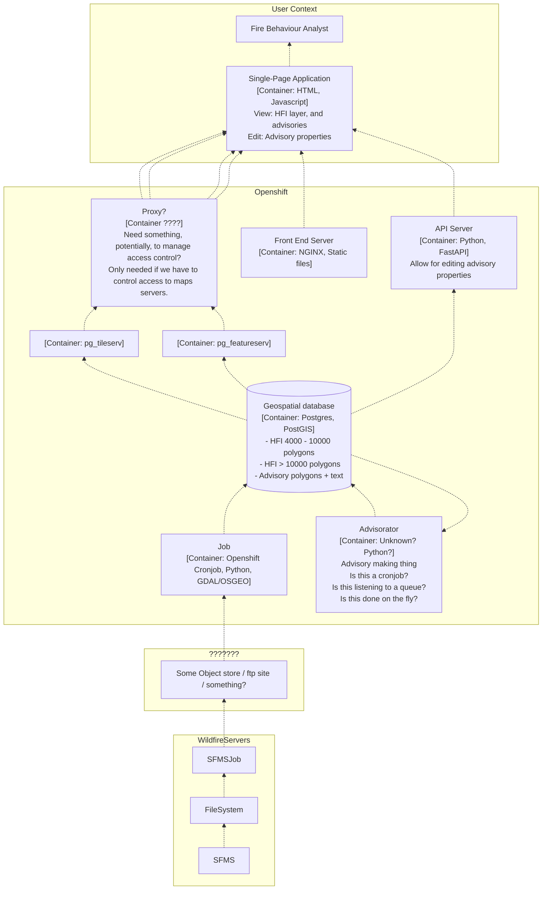
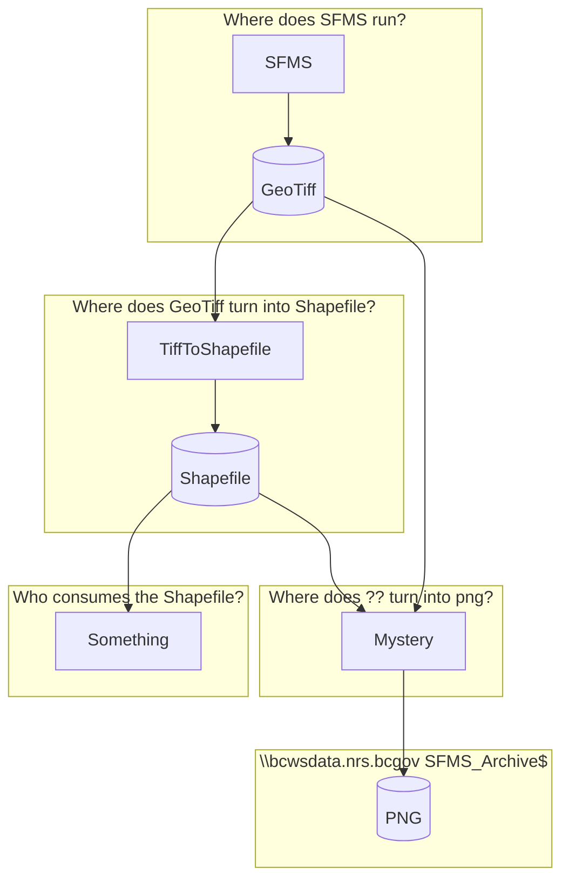

# Ideas

## Automated Advisory System (AutoNEAL):

```mermaid
graph BT

subgraph User Context
    Browser["Single-Page Application</br>[Container: HTML, Javascript]</br>View: HFI layer, and advisories</br>Edit: Advisory properties
    "]
    FBAN["Fire Behaviour Analyst"]

    Browser-.->FBAN
end

subgraph Openshift
    FrontEndServer["Front End Server</br>[Container: NGINX, Static files]"]
    Proxy["Proxy?</br>[Container ????]</br>Need something, potentially, to manage access control?</br>Only needed if we have to control access to maps servers."]
    BackEndServer["API Server</br>[Container: Python, FastAPI]</br>Allow for editing advisory properties"]
    FeatureServer["[Container: pg_featureserv]"]
    TileServer["[Container: pg_tileserv]"]
    Advisorator["Advisorator</br>[Container: Unknown? Python?]</br>Advisory making thing</br>Is this a cronjob?</br>Is this listening to a queue?</br>Is this done on the fly?"]
    PostGIS[("Geospatial database</br>[Container: Postgres, PostGIS]</br>- HFI 4000 - 10000 polygons</br> - HFI > 10000 polygons</br>- Advisory polygons + text")]
    Cronjob["Job</br>[Container: Openshift Cronjob, Python, GDAL/OSGEO]"]

    Cronjob-.->PostGIS
    PostGIS-.->Advisorator
    Advisorator-.->PostGIS
    PostGIS-.->TileServer
    PostGIS-.->FeatureServer
    PostGIS-.->BackEndServer

    Proxy-.->Browser
    Proxy-.->Browser
    Proxy-.->Browser
    Proxy-.->Browser

    FrontEndServer-.->Browser
    TileServer-.->Proxy
    FeatureServer-.->Proxy
    BackEndServer-.->Browser
end

subgraph WhatIsThis["???????"]
    ObjectStore["Some Object store / ftp site / something?"]
end

ObjectStore-.->Cronjob

subgraph WildfireServers
    SFMS
    FileSystem
    SFMSJob

    SFMS -.-> FileSystem
    FileSystem -.-> SFMSJob
end

SFMSJob -.-> ObjectStore
```

## A stab at understanding SFMS - maybe not needed? Drop this section

```mermaid
graph TB
    subgraph Where does SFMS run?
        SFMS-->GeoTiff
    end

    subgraph Where does GeoTiff turn into Shapefile?
        GeoTiff-->TiffToShapefile
        TiffToShapefile-->Shapefile
    end

    subgraph Where does ?? turn into png?
        GeoTiff-->Mystery
        Shapefile-->Mystery
    end

    subgraph \\bcwsdata.nrs.bcgov SFMS_Archive$
        Mystery-->PNG
        PNG[("PNG")]
    end

    subgraph Who consumes the Shapefile?
        Shapefile-->Something
    end

    GeoTiff[("GeoTiff")]
    Shapefile[("Shapefile")]


```
