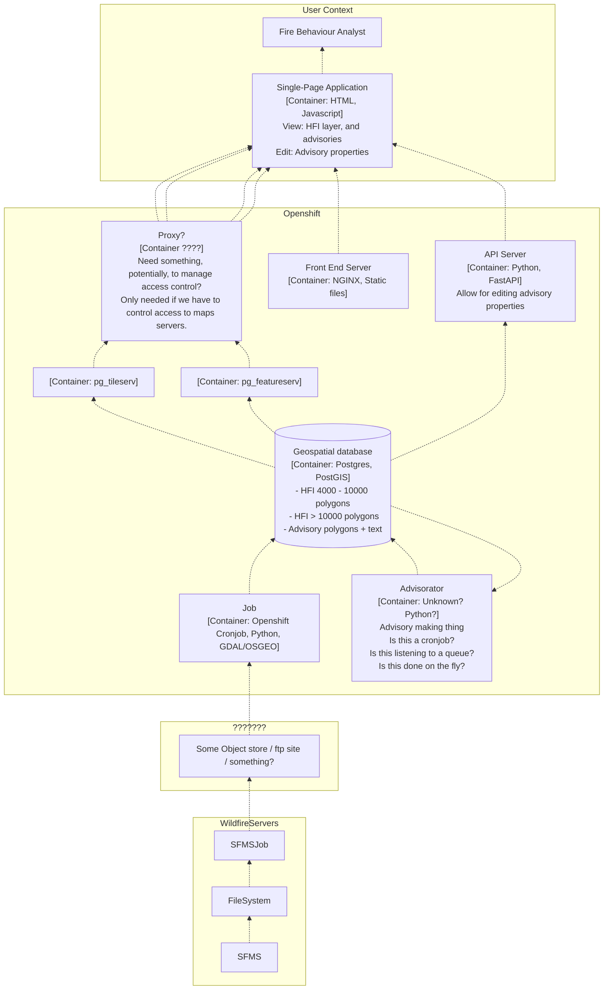
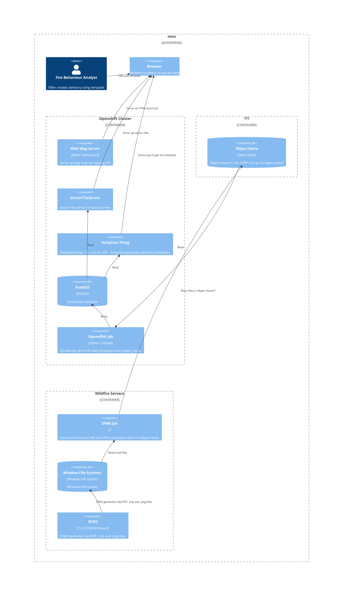
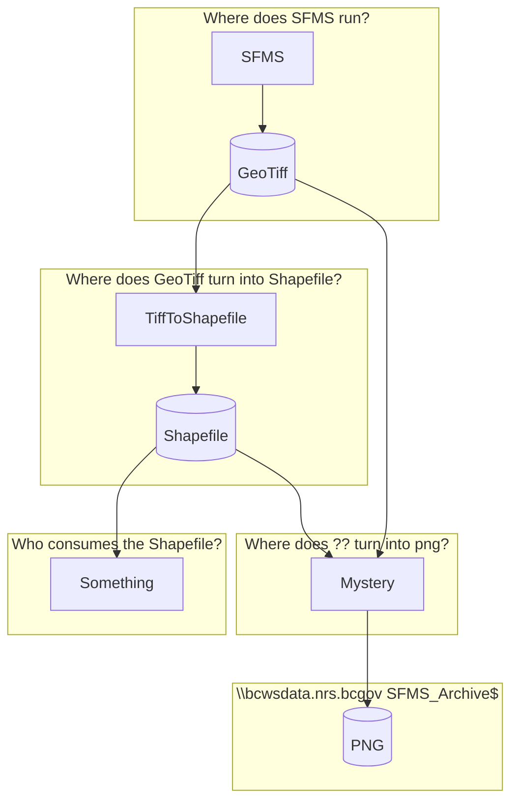

# Ideas

## HFI advisory template:

```mermaid
graph BT

subgraph User Context
    Browser["Single-Page Application</br>[Container: HTML, Javascript]</br>View: HFI layer, and advisories</br>Edit: Advisory properties
    "]
    FBAN["Fire Behaviour Analyst"]

    Browser-.->FBAN
end

subgraph Openshift
    FrontEndServer["Front End Server</br>[Container: NGINX, Static files]"]
    Proxy["Proxy?</br>[Container ????]</br>Need something, potentially, to manage access control?</br>Only needed if we have to control access to maps servers."]
    BackEndServer["API Server</br>[Container: Python, FastAPI]</br>Allow for editing advisory properties"]
    FeatureServer["[Container: pg_featureserv]"]
    TileServer["[Container: pg_tileserv]"]
    Advisorator["Advisorator</br>[Container: Unknown? Python?]</br>Advisory making thing</br>Is this a cronjob?</br>Is this listening to a queue?</br>Is this done on the fly?"]
    PostGIS[("Geospatial database</br>[Container: Postgres, PostGIS]</br>- HFI 4000 - 10000 polygons</br> - HFI > 10000 polygons</br>- Advisory polygons + text")]
    Cronjob["Job</br>[Container: Openshift Cronjob, Python, GDAL/OSGEO]"]

    Cronjob-.->PostGIS
    PostGIS-.->Advisorator
    Advisorator-.->PostGIS
    PostGIS-.->TileServer
    PostGIS-.->FeatureServer
    PostGIS-.->BackEndServer

    Proxy-.->Browser
    Proxy-.->Browser
    Proxy-.->Browser
    Proxy-.->Browser

    FrontEndServer-.->Browser
    TileServer-.->Proxy
    FeatureServer-.->Proxy
    BackEndServer-.->Browser
end

subgraph WhatIsThis["???????"]
    ObjectStore["Some Object store / ftp site / something?"]
end

ObjectStore-.->Cronjob

subgraph WildfireServers
    SFMS
    FileSystem
    SFMSJob

    SFMS -.-> FileSystem
    FileSystem -.-> SFMSJob
end

SFMSJob -.-> ObjectStore
```

```mermaid
C4Context
    
    Enterprise_Boundary(m0, "moo") {

    Person(FBA, "Fire Behaviour Analyst", "FBAn creates advisory using template")
    Component(Browser, "Browser", "Browser is used to access the web")

    Rel(FBA, Browser, "FBA uses Browser")
    Rel(WebMap, Browser, "Serve up HTML+Javscript")
    Rel(VectorTileServer, Browser, "Serve up vector tiles")
    Rel(TemplateThing, Browser, "Some way to get the template")


    Container_Boundary(Openshift, "Openshift Cluster") {
        Component(WebMap, "Web Map Server", "React, OpenLayers", "Serve up web map for viewing HFI")
        Component(VectorTileServer, "VectorTileServer", "", "Vector Tile Server / Feature Server")
        Component(TemplateThing, "Template Thing", "", "Template thing. It's a server, API - thing that generates advisory templates.")
        ComponentDb(PostGIS, "PostGIS", "PostGIS", "Geospatial database")
        Component(PSU_FETCH_JOB, "Opensfhit Job", "Python, Cronjob", "Periodically fetch HFI daily forecasts from Object Store.")

        Rel(Object Store, PSU_FETCH_JOB, "Read")
        Rel(PSU_FETCH_JOB, PostGIS, "Write")
        Rel(PostGIS, VectorTileServer, "Read")
        Rel(PostGIS, TemplateThing, "Read")
    }

    Container_Boundary(Object Store, "???") {
        ComponentDb(Object Store, "Object Store", "Object Store", "Object Store? Is this SFTP? Is it an S3 object store?")
    }

    Container_Boundary(WildfireServers, "Wildfire Servers") {
        Component(SFMS_JOB, "SFMS Job", "?", "Some job that picks HFI GeoTIFF's and places them in Object Store.")
        ComponentDb(SFMSFileSystem, "Window File Systems", "Windows File System", "Windows file system")
        Component(SFMS, "SFMS", "C++?,COM?,Windows?", "SFMS generates GeoTIFF, .shp and .png files.")

        Rel(SFMS, SFMSFileSystem, "SFMS generates GeoTIFF, .shp and .png files.")
        Rel(SFMSFileSystem, SFMS_JOB, "Read local files.")
        Rel(SFMS_JOB, Object Store, "Place files in Object Store??")
    }
    }
```

```mermaid
graph TB
    subgraph Where does SFMS run?
        SFMS-->GeoTiff
    end

    subgraph Where does GeoTiff turn into Shapefile?
        GeoTiff-->TiffToShapefile
        TiffToShapefile-->Shapefile
    end

    subgraph Where does ?? turn into png?
        GeoTiff-->Mystery
        Shapefile-->Mystery
    end

    subgraph \\bcwsdata.nrs.bcgov SFMS_Archive$
        Mystery-->PNG
        PNG[("PNG")]
    end

    subgraph Who consumes the Shapefile?
        Shapefile-->Something
    end

    GeoTiff[("GeoTiff")]
    Shapefile[("Shapefile")]


```
