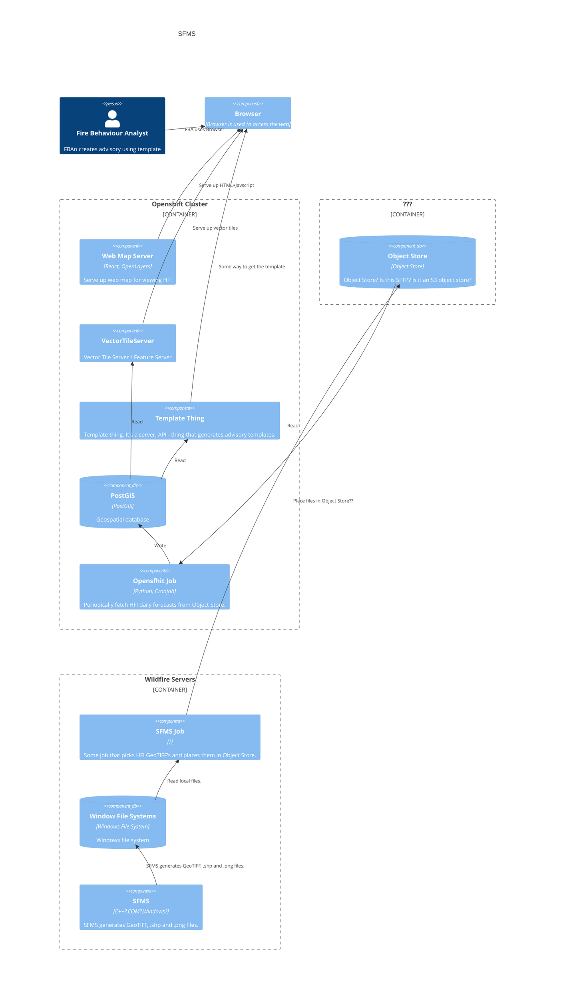
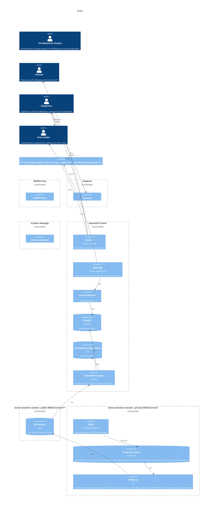
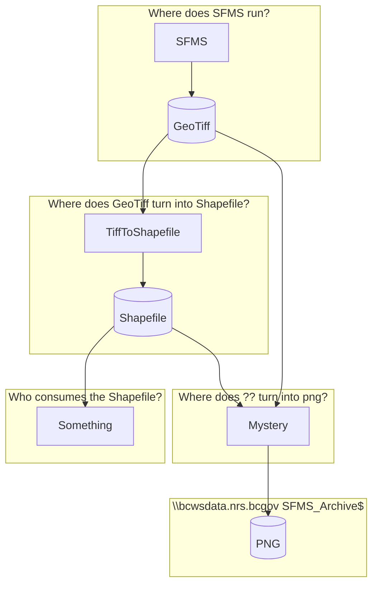

# Ideas

## HFI advisory template:

```mermaid
C4Context

    title SFMS

    Person(FBA, "Fire Behaviour Analyst", "FBAn creates advisory using template")
    Component(Browser, "Browser", "Browser is used to access the web")

    Rel(FBA, Browser, "FBA uses Browser")
    Rel(WebMap, Browser, "Serve up HTML+Javscript")
    Rel(VectorTileServer, Browser, "Serve up vector tiles")
    Rel(TemplateThing, Browser, "Some way to get the template")


    Container_Boundary(Openshift, "Openshift Cluster") {
        Component(WebMap, "Web Map Server", "React, OpenLayers", "Serve up web map for viewing HFI")
        Component(VectorTileServer, "VectorTileServer", "", "Vector Tile Server / Feature Server")
        Component(TemplateThing, "Template Thing", "", "Template thing. It's a server, API - thing that generates advisory templates.")
        ComponentDb(PostGIS, "PostGIS", "PostGIS", "Geospatial database")
        Component(PSU_FETCH_JOB, "Opensfhit Job", "Python, Cronjob", "Periodically fetch HFI daily forecasts from Object Store.")

        Rel(Object Store, PSU_FETCH_JOB, "Read")
        Rel(PSU_FETCH_JOB, PostGIS, "Write")
        Rel(PostGIS, VectorTileServer, "Read")
        Rel(PostGIS, TemplateThing, "Read")
    }

    Container_Boundary(Object Store, "???") {
        ComponentDb(Object Store, "Object Store", "Object Store", "Object Store? Is this SFTP? Is it an S3 object store?")
    }

    Container_Boundary(WildfireServers, "Wildfire Servers") {
        Component(SFMS_JOB, "SFMS Job", "?", "Some job that picks HFI GeoTIFF's and places them in Object Store.")
        ComponentDb(SFMSFileSystem, "Window File Systems", "Windows File System", "Windows file system")
        Component(SFMS, "SFMS", "C++?,COM?,Windows?", "SFMS generates GeoTIFF, .shp and .png files.")

        Rel(SFMS, SFMSFileSystem, "SFMS generates GeoTIFF, .shp and .png files.")
        Rel(SFMSFileSystem, SFMS_JOB, "Read local files.")
        Rel(SFMS_JOB, Object Store, "Place files in Object Store??")
    }
```

## Here's an idea:

```mermaid
C4Container
title SFMS


Person(FBA, "Fire Behaviour Analyst", "A fire behaviour analyst creates a Fire Behaviour Forecast using what?")
Person(Planner, "Planner", "Planner puts Fire Behavious Forecast in IAP?")
Person(Dispatcher, "Dispatcher", "Dispatcher radios Fire Behaviour Forecast to the crew leader?")
Person(CrewLeader, "Crew Leader", "Communicates predicted fire conditions to their crew?")

Container_Boundary(WF1, "Wildfire One") {
    Component(WF1, "Wildfire One")
    Rel(Dispatcher, Dispatch, "Uses", "HTTPS")
    Rel(Dispatcher, CrewLeader, "Broadcasts", "Radio")
}

Container_Boundary(DispatchContainer, "Dispatch") {
    Component(Dispatch, "Dispatch")
}

Container_Boundary(IncidentManagerContainer, "Incident Manager") {
    Component(IncidentManager, "Incident Manager")
}

Container_Boundary(Openshift, "Openshift Cluster") {
    Component(Email, "Emailer", "Python, Cronjob", "Email advisory to interested parties")
    Component(WebMap, "Web Map", "Python, OpenLayers", "Some place where FBA can see all the layers they want?")
    Component(VectorTileServer, "VectorTileServer", "", "Vector Tile Server")
    ComponentDb(PostGIS, "PostGIS", "PostGIS", "Geospatial database")
    ComponentDb(OBJECT_STORE, "S3 compliant object store", "S3", "Do we need this?")
    Component(PSU_JOB, "Opensfhit Cronjob", "Python", "Periodically fetch daily forecasts from FTP site.")

    Rel(WebMap, VectorTileServer, "Uses")
    Rel(WebMap, BCMapServer, "Uses")

    Rel(VectorTileServer, PostGIS, "Uses")
    Rel(FTP, PSU_JOB, "Pull")
    Rel(PSU_JOB, OBJECT_STORE, "Store")
    Rel(PSU_JOB, PostGIS, "Store")
    Rel(Email, Planner, "Email")
    Rel(Email, Dispatcher, "Email")
    Rel(Email, CrewLeader, "Email")
}

Container_Boundary(c2, "Some container context - public NRIDS Servers???") {
    ComponentDb(FTP, "File Server?", "FTP", "FTP site? with daily forecasts")
}

Container_Boundary(c1, "Some container context - private NRIDS Servers?") {
    Component(SFMS, "SFMS", "C++?,COM?,Windows?", "SFMS generates GeoTIFF and .shp files.")
    ComponentDb("SFMS_STORE", "Some data store?", "Disk drive?", "GeoTIFF and .shp files are stored somewhere after being generated. Is it on the same server that generates it? Is it some network drive?")
    Component(SFMS_JOB, "SFMS Job", "?", "Some job that moves daily forecast GeoTIFF and .shp files to a file store? Runs every day at 9am? When are files guaranteed to be available?")

    Rel(SFMS, SFMS_STORE, "Generate")
    Rel(SFMS_STORE, SFMS_JOB, "Pull")
    Rel(SFMS_JOB, FTP, "Push")

}

Component(BCMapServer, "BC has various maps it can serve up as raster tiles, e.g.: https://maps.gov.bc.ca")

```

ContainerDb(SFMS_STORE, "Some data store?", "Disk drive?", "GeoTIFF and .shp files are stored somewhere after being generated?")

```mermaid
graph TB
    subgraph Where does SFMS run?
        SFMS-->GeoTiff
    end

    subgraph Where does GeoTiff turn into Shapefile?
        GeoTiff-->TiffToShapefile
        TiffToShapefile-->Shapefile
    end

    subgraph Where does ?? turn into png?
        GeoTiff-->Mystery
        Shapefile-->Mystery
    end

    subgraph \\bcwsdata.nrs.bcgov SFMS_Archive$
        Mystery-->PNG
        PNG[("PNG")]
    end

    subgraph Who consumes the Shapefile?
        Shapefile-->Something
    end

    GeoTiff[("GeoTiff")]
    Shapefile[("Shapefile")]


```
