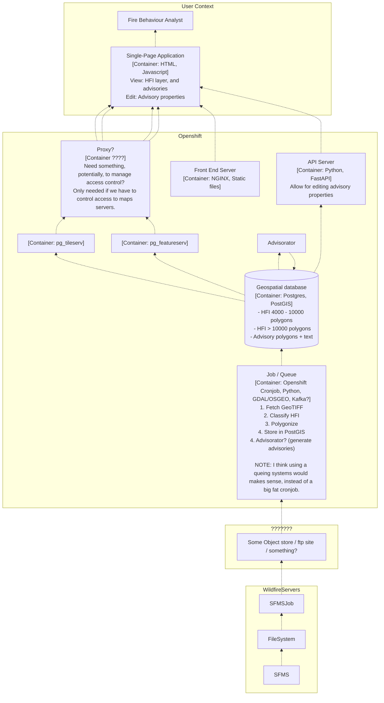

# Ideas

## Automated Advisory System (AutoNEAL):

NOTE: This is a work in progress.

NOTE: Given the experience of processing GRIB files in MoreCast, and generating C-Haines - I think a good idea would be to use a Queueing system to tie together all the pieces. That way we'd have only one cronjob, that places GeoTIFF files onto a Queue, and from there on have nicely decoupled processes that generate outputs. You could sequence everything together in the context of the cronjob, but it doesn't scale nicely and makes for very tightly coupled code.

## A stab at understanding SFMS - maybe not needed? Drop this section

