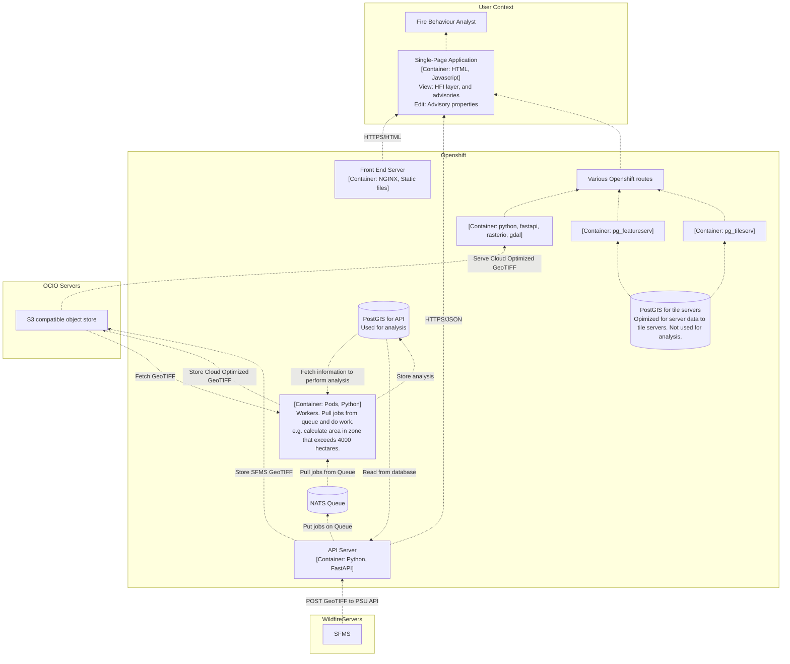

# Ideas

## Automated Fire Behaviour Advisory System:

This architecture is a work in progress illustrating our current thinking of what the final system will look like and is subject to change.

```mermaid
graph BT

subgraph User Context
    Browser["Single-Page Application</br>[Container: HTML, Javascript]</br>View: HFI layer, and advisories</br>Edit: Advisory properties
    "]
    FBAN["Fire Behaviour Analyst"]

    Browser-.->FBAN
end

subgraph Openshift
    FrontEndServer["Front End Server</br>[Container: NGINX, Static files]"]
    Routes["Various Openshift routes"]
    API["API Server</br>[Container: Python, FastAPI]"]
    FeatureServer["[Container: pg_featureserv]"]
    VectorTileServer["[Container: pg_tileserv]"]
    RasterTileServer["[Container: python, fastapi, rasterio, gdal]"]

    APIPostGIS[("PostGIS for API<br/>Used for analysis")]
    Queue[("NATS Queue")]
    TileServerPostGIS[("PostGIS for tile servers</br>Opimized for server data to tile servers. Not used for analysis.")]
    Workers["[Container: Pods, Python]</br>Workers. Pull jobs from queue and do work.</br>e.g. calculate area in zone that exceeds 4000 hectares."]

    API-."Put jobs on Queue".->Queue
    Queue-."Pull jobs from Queue".->Workers
    Workers-."Store analysis".->APIPostGIS
    TileServerPostGIS-.->VectorTileServer
    TileServerPostGIS-.->FeatureServer
    APIPostGIS-."Read from database".->API
    APIPostGIS-."Fetch information to perform analysis".->Workers

    Routes-.->Browser
    
    VectorTileServer-.->Routes
    FeatureServer-.->Routes
    RasterTileServer-.->Routes
end

API-."HTTPS/JSON".->Browser
FrontEndServer-."HTTPS/HTML".->Browser
API -."Store SFMS GeoTIFF".-> ObjectStore

subgraph OCIOServers["OCIO Servers"]
    ObjectStore["S3 compatible object store"]
end

ObjectStore-."Fetch GeoTIFF".->Workers
Workers-."Store Cloud Optimized GeoTIFF".->ObjectStore
ObjectStore-."Serve Cloud Optimized GeoTIFF".->RasterTileServer


subgraph WildfireServers
    SFMS
end

SFMS -."POST GeoTIFF to PSU API".-> API
```
