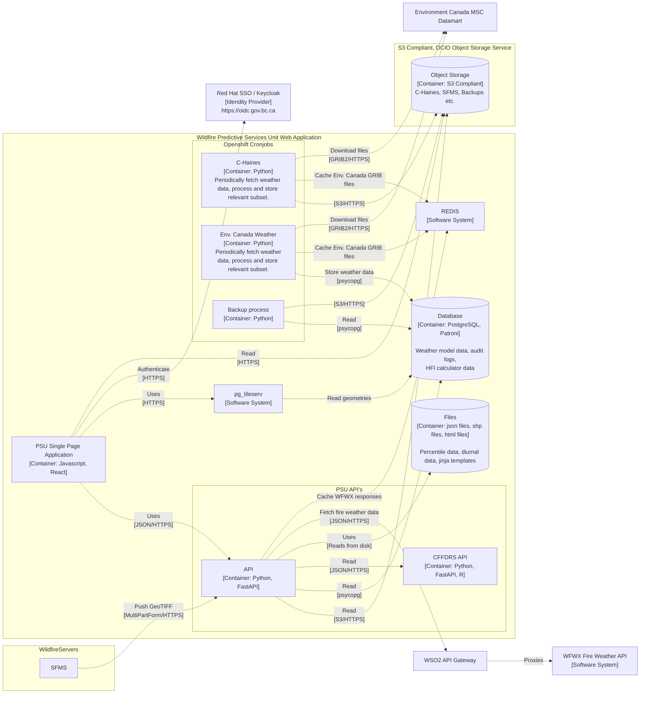
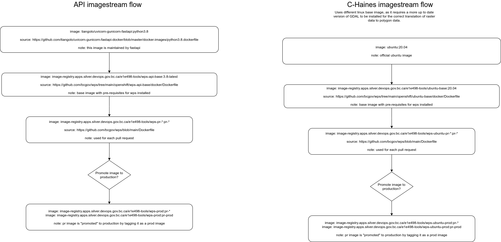

## Architecture

_if you're not seeing an architecture diagram below, you need the mermaid plugin_

```mermaid
graph LR

    datamart["Environment Canada MSC Datamart"]

    wf1["WFWX Fire Weather API</br>[Software System]"]

    wso2["WSO2 API Gateway"]

    sso["Red Hat SSO / Keycloak</br>[Idendity Provider]</br>https://oidc.gov.bc.ca"]

    subgraph Wildfire Predictive Services Unit Web Application
        FrontEnd["PSU Single Page Application</br>[Container: Javascript, React]"]

        subgraph PSU API's
            API["API</br>[Container: Python, FastAPI]"]
            CFFDRS_API["CFFDRS API</br>[Container: Python, FastAPI, R]"]
        end

        pg_tileserv["pg_tileserv</br>[Software System]"]
        redis["REDIS</br>[Software System]"]

        subgraph Openshift Cronjobs
            c-haines["C-Haines</br>[Container: Python]</br>Periodically fetch weather data, process and store relevant subset."]
            env-canada["Env. Canada Weather</br>[Container: Python]</br> Periodically fetch weather data, process and store relevant subset."]
            backup["Backup process</br>[Container: Python]"]
        end

        Database[("Database</br>[Container: PostgreSQL, Patroni]</br></br>Weather model data, audit logs,</br>HFI calculator data")]
        Files[("Files</br>[Container: json files, shp files, html files]</br></br>Percentile data, diurnal data, jinja templates")]

    end

    subgraph "S3 Compliant, OCIO Object Storage Service"
        s3[("Object Storage</br>[Container: S3 Compliant]</br>C-Haines, SFMS, Backups etc.")]
    end

    subgraph WildfireServers
        SFMS
    end

    SFMS-."Push GeoTIFF</br>[MultiPartForm/HTTPS]".->API

    API-. "Read</br>[S3/HTTPS]" .->s3
    API-.->|"Read</br>[psycopg]"|Database
    API-.->|"Read</br>[JSON/HTTPS]"|CFFDRS_API
    API-.->|"Uses</br>[Reads from disk]"|Files
    API-. "Fetch fire weather data</br>[JSON/HTTPS]" .->wso2
    API-. "Cache WFWX responses" .->redis
    wso2-. "Proxies" .->wf1
    pg_tileserv-. "Read geometries" .->Database
    FrontEnd-.->|"Uses</br>[JSON/HTTPS]"|API
    FrontEnd-.->|"Uses</br>[HTTPS]"|pg_tileserv
    FrontEnd-. "Authenticate</br>[HTTPS]" .->sso
    FrontEnd-. "Read</br>[HTTPS]" .->s3
    c-haines-. "[S3/HTTPS]" .->s3
    c-haines-. "Cache Env. Canada GRIB files" .->redis
    c-haines-. "Download files</br>[GRIB2/HTTPS]" .->datamart
    env-canada-. "Store weather data</br>[psycopg]" .->Database
    env-canada-. "Cache Env. Canada GRIB files" .->redis
    env-canada-. "Download files</br>[GRIB2/HTTPS]" .->datamart
    backup-. "Read</br>[psycopg]" .->Database
    backup-. "[S3/HTTPS] " .->s3

```

### Imagestream flow

