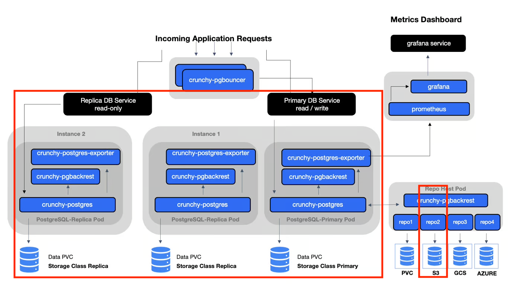
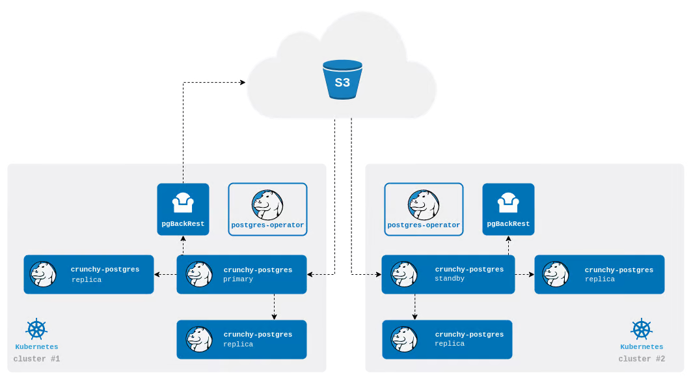

# Cluster Database

## Overview

The diagram below shows an overview of the database cluster. The components circled in red are the pieces we use operationally at the time of writing.


Source: <https://access.crunchydata.com/documentation/postgres-operator/latest/architecture>

## Components

- `Primary` Postgres instance

  - The primary postgres database that replica instances replicate from

- `Replica` Postgres instances

  - Replicas stream WAL logs from the primary to keep themselves up to date as data changes occur

- `pgbackrest`

  - This runs in a container alongside the postgres database and pushes WAL archives to the S3 repo. The wal logs enable bootstrapping of new clusters as well as backups.

  - Backup specific configuration is declared in [crunchy.yaml](../../openshift/templates/crunchy.yaml), notably:

    - The `path` to the archive/backup is specified as /`pgbackrest/${SUFFIX}/repo1`
    - **Full Backup**: scheduled weekly on Sunday at 1am
    - **Differential Backup**: taken daily at 1am, except on Sundays
    - **Manual Backup**: are enabled through the `manual` configured property

      - **Trigger a manual backup**, by annotating the primary cluster with: `kubectl annotate -n <namespace-license-plate> postgrescluster <postgres-cluster> --overwritepostgres-operator.crunchydata.com/pgbackrest-backup="$( date '+%F\_%H:%M:%S' )"`

    - To see the status of a backup look in the condition block of the result of`oc describe postgrescluster <postgres-cluster>`, e.g.:

            Last Transition Time:  2024-02-13T23:51:47Z
            Message:               Manual backup completed successfully
            Observed Generation:   16
            Reason:                ManualBackupComplete
            Status:                True
            Type:                  PGBackRestManualBackupSuccessful

## Disaster Recovery (DR)

In the rare case where the multi-instance primary cluster is unrecoverable a repo-based standby cluster can be spun up and bootstrapped from the S3 archive repo.


Source: <https://access.crunchydata.com/documentation/postgres-operator/latest/architecture/disaster-recovery#repo-based-standby>

When the repo-standby is spun, it reads and applies the WAL in order to replicate the state of the database and runs as it's own cluster, separate from the primary.

Spin up the Repo-Standby Cluster with:
`PROJ_TARGET=<namespace-license-plate> BUCKET=<s3-bucket> bash openshift/scripts/oc_provision_crunchy_standby.sh <suffix> apply`

- Anecdotally, spinning up a standby cluster for a 15GB database took about 5 minutes

##### Promoting a Standby Cluster

Once a standby is stood up, it can be promoted to be the primary cluster. **Note: only do this if the existing primary has been shut down first.**
You can shutdown the primary cluster with this command:  
`kubectl patch postgrescluster/<cluster-name> --type merge --patch '{"spec":{"shutdown": true}}'`  
You can determine that the cluster is fully shutdown when there are no StatefulSet pods running for that cluster.

Promote the standby cluster by editing the [crunchy_standby.yaml](../../openshift/templates/crunchy_standby.yaml) to set the `standby` field to `false`.
You can determine that promotion has completed when the logs of the standby StatefulSet show a leader has been elected.

More details here: <https://access.crunchydata.com/documentation/postgres-operator/latest/architecture/disaster-recovery#promoting-a-standby-cluster>

##### Database user privileges

The promoted standby cluster created it's own secrets for connecting to pgbouncer and it has created a new user in the database with the same name as the cluster. Ex. if the standby cluster is named "wps-crunchy-16-20241210", the user will have the same name (this user won't be created until the standby is promoted).
Once the standby has been promoted, the easiest way to update user privileges is to reassign table ownership from the old user to the new user:  
`REASSIGN OWNED BY "<old-user>" TO "<new-user>";`  
Use `\du` in psql to see users in the database.

##### Update the prod deployment to use the new crunchydb cluster and pguser secret

Create a PR with the following changes:

- Update `CRUNCHY_NAME` in `envars` file to the new crunchydb cluster name (excluding the suffix)
- Update `PATRONI_CLUSTER_NAME` in `deploy.yaml`.

## Cluster Restore From pg_dump

In the event that the cluster can't be restored from pgbackrest you can create a new cluster and restore using a pg_dump from S3.

##### Deploy new cluster

```
oc login --token=<your-token> --server=<openshift-api-url>
PROJ_TARGET=<namespace-license-plate> BUCKET=<s3-bucket> CPU_REQUEST=75m MEMORY_REQUEST=2Gi MEMORY_LIMIT=16Gi DATA_SIZE=65Gi WAL_SIZE=45Gi bash ./oc_provision_crunchy.sh <suffix> apply
```

##### Set superuser permissions in new cluster via OpenShift web GUI

Login to the OpenShift UI and use `patronictl list` to identify the new cluster's leader pod. The role to update will be something like `wps-crunchydb-16-<suffix>`. You can confirm the role by exploring the pg_roles table with:
`psql -c "SELECT * FROM pg_roles"`.
Access the terminal of the leader pod and execute:
`psql -c 'ALTER ROLE "<wps-crunchydb-username>" SUPERUSER'`

##### Setup port forwarding from your local machine to the new cluster

Use the OpenShift UI to determine the name of the secret the CrunchyDB Operator generated following creation of the empty cluster (eg. wps-crunchydb-16-\<suffix>-pguser-wps-crunchydb-16-\<suffix>). Ensure you have stopped your local postgres instance if it is listening on port 5432.

```
PG_CLUSTER_PRIMARY_POD=<wps-crunchydb-leader-pod-name>
PGPASSWORD=$(oc get secrets -n <namespace-license-plate> "<wps-crunchydb-pguser-secret-name>" -o go-template='{{.data.password | base64decode}}')
PGUSER=$(oc get secrets -n <namespace-license-plate> "<wps-crunchydb-pguser-secret-name>" -o go-template='{{.data.user | base64decode}}')
PGDATABASE=$(oc get secrets -n <namespace-license-plate> "<wps-crunchydb-pguser-secret-name>" -o go-template='{{.data.dbname | base64decode}}')
oc -n <namespace-license-plate>  port-forward "${PG_CLUSTER_PRIMARY_POD}" 5432:5432
```

##### Restore sql dump into new cluster in another shell

Download the latest SQL dump from S3 storage and unzip it.

```
PG_CLUSTER_PRIMARY_POD=<wps-crunchydb-leader-pod-name>
PGPASSWORD=$(oc get secrets -n <namespace-license-plate> "<wps-crunchydb-pguser-secret-name>" -o go-template='{{.data.password | base64decode}}')
PGUSER=$(oc get secrets -n <namespace-license-plate> "<wps-crunchydb-pguser-secret-name>" -o go-template='{{.data.user | base64decode}}')
PGDATABASE=$(oc get secrets -n <namespace-license-plate> "<wps-crunchydb-pguser-secret-name>" -o go-template='{{.data.dbname | base64decode}}')
PGPASSWORD=$PGPASSWORD psql -U $PGUSER -d wps -h localhost < wps-crunchydb-sql-dump-name.sql
```

##### Remove superuser privileges from pguser

This step is required as pgbouncer will not connect to the cluster/database with a superuser.
Login to the OpenShift UI and use `patronictl list` to identify the new cluster's leader pod. Access the terminal of the leader pod and execute:
`psql -c 'ALTER ROLE "<wps-crunchydb-username>" NOSUPERUSER'`

##### Update the prod deployment to use the new crunchydb cluster and pguser secret

Create a PR with the following changes:

- Update `CRUNCHY_NAME` in `envars` file to the new crunchydb cluster name (excluding the suffix)
- Update `PATRONI_CLUSTER_NAME` in `deploy.yaml`.
