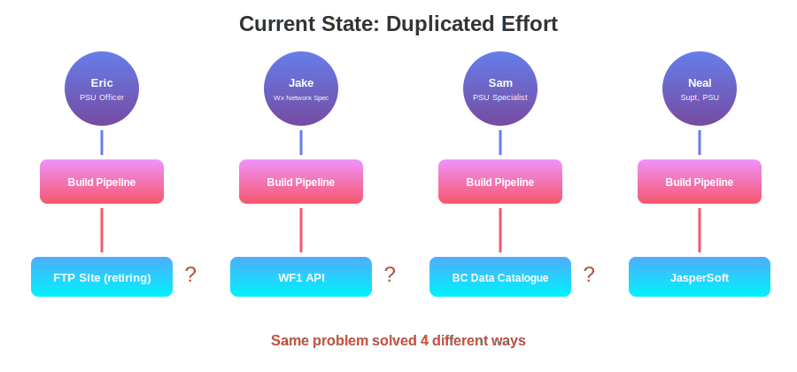
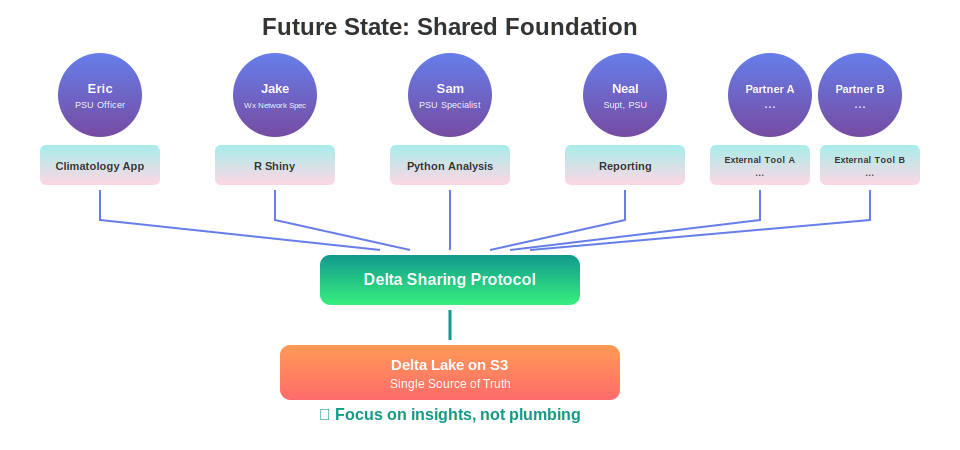

<!-- _class: lead -->

# Delta Lake & Open Data Sharing
## Modernizing BC Wildfire Service Weather Data Infrastructure

---

# How This Started: A Climatology Request

### The Ask
Eric Kopetski requested **climatology visualizations** — compare current fire weather conditions against historical norms.

### What We Discovered
- Jake Lee presented an **R Shiny dashboard** with similar visualizations
- Sam Siddall had been doing **overlapping analyses** independently
- Everyone was spending time **sourcing data** instead of building tools

**Pattern emerged: smart people, duplicated effort, data bottleneck.**

---

# The Data Landscape Today

| Source | What It Has | Problem |
|--------|-------------|---------|
| BC Data Catalogue | Metadata, some CSVs | Stale, hard to find |
| WF1 API | Operational data | Not designed for historical analysis |
| FTP Site | Historical CSVs | **Retiring soon** |
| Jaspersoft Server | Reports, exports | Another copy, limited access |

### The Real Issue
- **4+ copies** of weather data across systems
- Everyone builds their own pipeline
- No single source of truth

---



---



---

# BC Government Mandate: Manage Data Effectively

> "Ethical, accurate, accessible data forms the foundation of digital government"
> — **BC Digital Code of Practice**

### DCOP Requirements We're Addressing

- **Reduce duplication** — Single source of truth, not scattered CSV copies
- **Interoperability** — Standard metadata and interfaces for easy exchange
- **Findability & Reusability** — Catalogued tables, documented schemas
- **Data lifecycle management** — From collection to final disposition
- **Quality assurance** — Validated, consistent data formats

**Source:** [digital.gov.bc.ca/policies-standards/dcop/data/](https://digital.gov.bc.ca/policies-standards/dcop/data/)

---

# The Old Way: Expensive & Complex

- **Dedicated databases** — Licensing, maintenance, DBAs
- **ETL pipelines** — Custom code for every consumer
- **Data warehouses** — Costly infrastructure to scale
- **Multiple copies** — Storage costs multiply

### The Hidden Costs Add Up

| Component | What You Pay For |
|-----------|------------------|
| Storage | Database servers, SAN storage |
| Compute | Always-on clusters, reserved capacity |
| Scaling | Buy bigger hardware, migrations |
| Licensing | Per-core, per-user fees |

---

# The New Way: Simple & Scalable

### Delta Lake on Object Storage

| Component | Delta Lake Approach |
|-----------|---------------------|
| Storage | **S3** — pennies per GB |
| Compute | **Serverless** — pay per query |
| Scaling | **Automatic** — cloud-native |
| Licensing | **Open source** — free |

### Cost Impact

| Type | Cost/TB/month |
|------|---------------|
| Enterprise database | $500 - $2,000 |
| S3 object storage | **$23** (96% savings) |

---

# Why Delta Lake?

### Open Source Lakehouse Format
- **Columnar format** — Optimal for 40 years of historical wildfire data
- **ACID Transactions** — Safe concurrent writes, no corruption
- **Time Travel** — Query data at any historical point
- **Schema Evolution** — Add columns without breaking queries

### Performance Comparison

| Operation | CSV (Current) | Delta Lake |
|-----------|--------------|------------|
| Load 1 year | Minutes | **Seconds** |
| Query single station | Scan all files | **Partition pruning** |
| Daily updates | Rewrite everything | **Appendable** |

**No intermediate copies. No stale data.**

---

# Why Delta Lake? (cont.)

### Open Standards — No Vendor Lock-in

> Backed by **Linux Foundation**

- **Host API anywhere** — On-prem, AWS, Azure, GCP
- **Native Libraries:** Python, R, Rust, Java, Scala
- **Power BI & Excel:** [Native connectors](https://learn.microsoft.com/en-us/power-query/connectors/delta-sharing) for non-programmers
- **Protocol Spec:** [github.com/delta-io/delta-sharing](https://github.com/delta-io/delta-sharing/blob/main/PROTOCOL.md)

---

# What We Built: Automated Pipeline

### Data Crawler
```bash
python -m wps_deltalake.crawler --all
```

**Capabilities:**
- Crawls Legacy FTP site automatically
- Incremental updates (only new data)
- Partitioned by year/month for fast queries
- Enriches station metadata

---

# What We Built: Four Optimized Tables

| Table | Purpose | Partitioning |
|-------|---------|--------------|
| `observations` | All hourly weather data | year, month |
| `stations` | Station metadata | — |
| `observations_by_station` | Per-station analysis | station_code |
| `climatology_stats` | Pre-computed percentiles | — |

### Maintenance Built-in
```bash
python -m wps_deltalake.maintenance --all
```
Checkpoint • Optimize • Vacuum

---

# Delta Sharing: Open Data Protocol

| Aspect | Traditional Sharing | Delta Sharing |
|--------|---------------------|---------------|
| **Process** | Extract → Copy → Share → Repeat | Query live data |
| **Data copies** | Many (one per consumer) | **None** (presigned URLs) |
| **Freshness** | Stale (point-in-time exports) | **Always live** |
| **Governance** | Who has what version? | **Single source of truth** |
| **Languages** | Whatever you export to | **Python, R, Spark, etc.** |
| **Security** | File permissions | **Token-based auth** |

---

<!-- _class: invert -->

# How Partners Access Data: Python

```python
import delta_sharing

profile = {"shareCredentialsVersion": 1, "endpoint": endpoint, "bearerToken": token}
client = delta_sharing.SharingClient(profile)

tables = client.list_all_tables()
for t in tables:
    print(f"   - {t.share}.{t.schema}.{t.name}")

df = delta_sharing.load_as_pandas(f"{profile_path}#historical.default.stations")
```

---

<!-- _class: invert -->

# How Partners Access Data: R

```r
library(httr)
library(arrow)

response <- POST(
  paste0(endpoint, "/shares/historical/schemas/default/tables/stations/query"),
  add_headers(.headers = headers), body = "{}", encode = "raw")

file_urls <- lapply(parsed, function(item) item$file$url)
df <- read_parquet(file_urls[[1]])
```

---

# DCOP Alignment Summary

| DCOP Mandate | How We Deliver |
|--------------|----------------|
| Reduce duplication | Single Delta Lake source, no CSV copies |
| Interoperability | Open standards (Parquet, Delta Sharing) |
| Easy exchange & reuse | Python/R/Spark clients, presigned URLs |
| Metadata standards | Schema versioning, partition metadata |
| Lifecycle management | Automated ETL, maintenance, vacuum |
| Quality assurance | ACID transactions, schema enforcement |

**This project directly advances BC's digital transformation goals.**

---

# Key Takeaways

<div style="display: flex; justify-content: space-around;">
<div style="text-align: center;">
<strong>1. Policy Aligned</strong><br>
Delivers on DCOP mandate<br>
Reduces duplication
</div>
<div style="text-align: center;">
<strong>2. Fiscally Responsible</strong><br>
90%+ cost savings<br>
Open source, no licensing<br>
Scales without investment
</div>
</div>

<br>

<div style="text-align: center;">
<strong>3. Open Standards</strong><br>
Linux Foundation backed<br>
No vendor lock-in<br>
10-100x faster queries
</div>

---

<!-- _class: lead -->

# Questions?

**Resources**
- Delta Lake: [delta.io](https://delta.io)
- Delta Sharing: [github.com/delta-io/delta-sharing](https://github.com/delta-io/delta-sharing)

**Demo**
- Climatology: `/climatology`
- Delta Sharing: `/api/delta-sharing`
